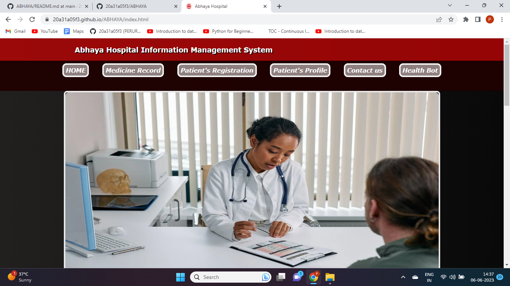
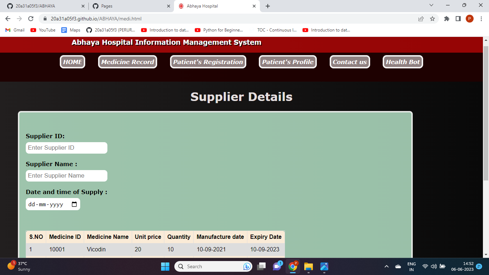
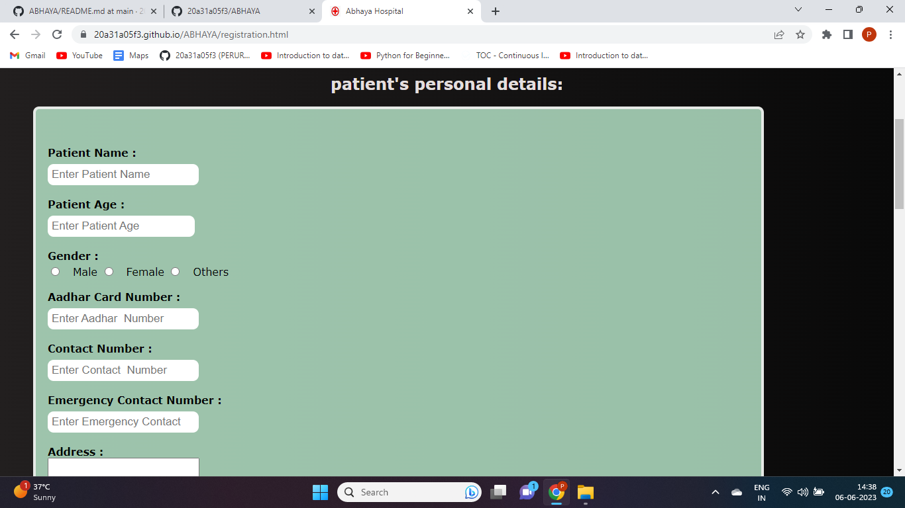
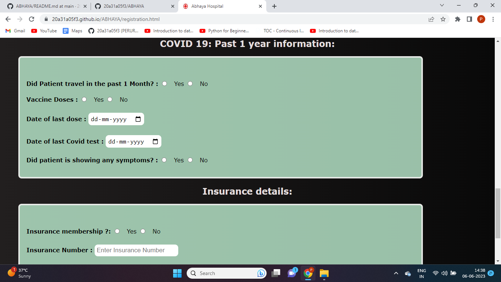
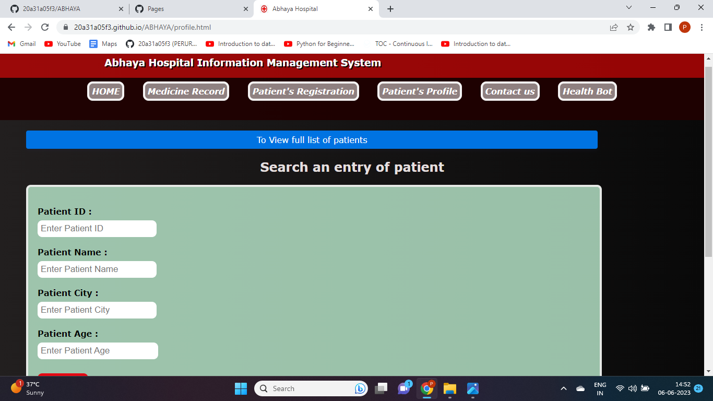
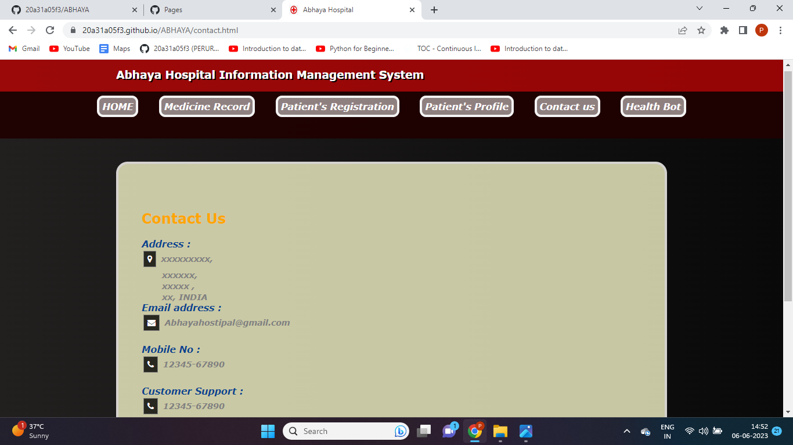
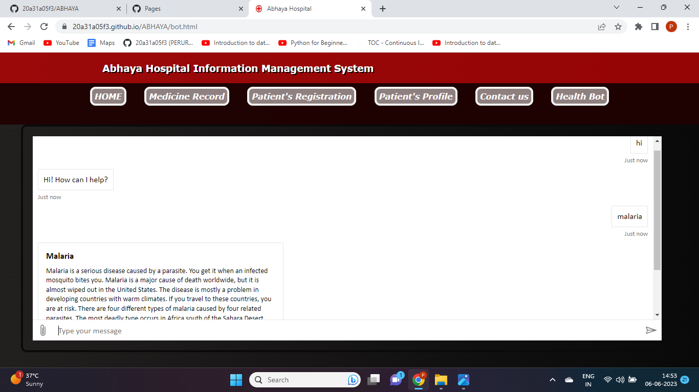

# **Project:✨Hospital Information Management System✨**

- This is a web based application developed for health related problems

## **`Azure technologies`** used For this Project

1. Static Web Apps
2. Health bot
    

**Project Link** - [`(https://zealous-moss-072f16f00.3.azurestaticapps.net)`](https://zealous-moss-072f16f00.3.azurestaticapps.net)  
**Project Demo Video Link** - [`https://youtu.be/X08rNWMD7RA`](https://youtu.be/X08rNWMD7RA)

  

## The website has following **`Features`** and **`Functionalities`**

- Interactive and responsive UI.
- Has many graphical and visual innovative effects.
- Have an aesthetically pleasing visual design and architecture.
- Has collection of many web pages including Home,Medical Record,Patient's Registration, Contact Us, Health Bot related information etc.
- User can know about Health related problems through this website.
- Included the Health Bot to know Health related issues from the AI-powered virtual health assistants
   

## SCREENSHOTS 📸

### `Home Page`

### `MEDICAL RECORD PAGE`

### `PATIENTS REGISTRATION PAGE`

### `PATIENTS PROFILE PAGE`

### `CONTACT US PAGE`

### `Healthbot PAGE`

 

## TECH STACK 💻

- Azure
- GitHub
- HTML
- CSS
- JavaScript
